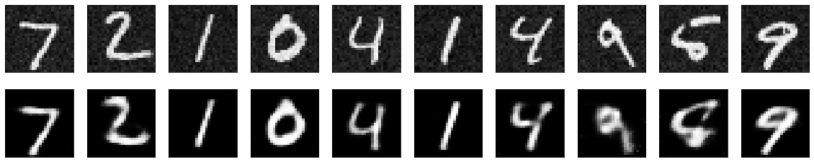
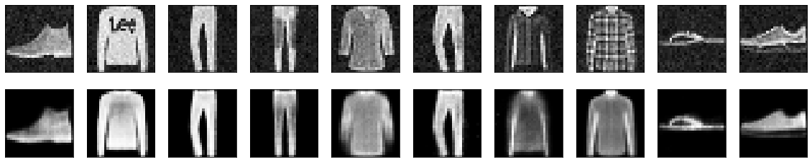
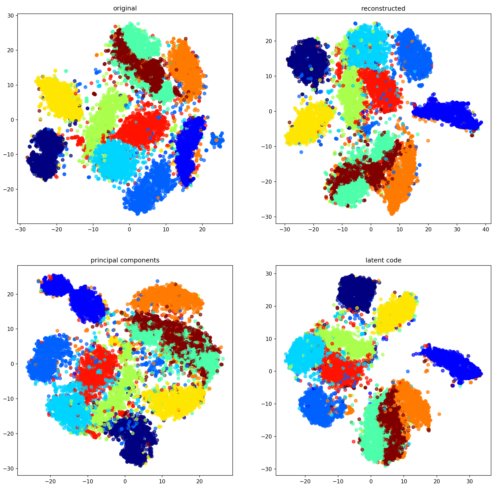
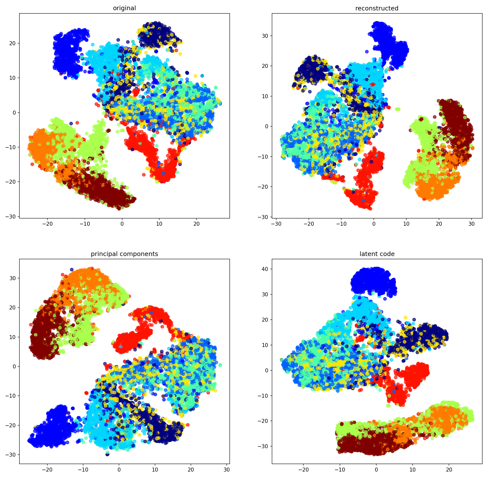
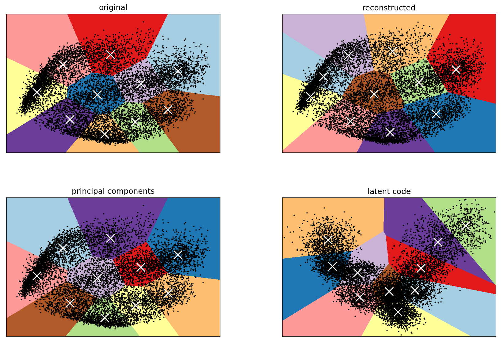

Improved Clustering Performance using Latent Data Representation from Variational Autoencoder
===

## Abstract

Clustering is a well-studied task in terms of development of efficient algorithms, better initialization algorithms, and better distance functions. Conventionally, datasets are used as they are, or with some normalization done before using them as input to a clustering algorithm. In this study, we present using the learned latent data representation of a variational autoencoder as input to a clustering algorithm. We compared the clustering on the original data representation, on the reconstructed data, and on the learned latent data representation. Results have shown that the best clustering was on the latent data representation, with a Davies-Bouldin Index (DBI) of 1.328, Silhoutte Score (SS) of 0.238, and Calinski-Harabasz Score (CHS) of ~3609, while using the original data representation gained a DBI of 1.811, SS of 0.155, and CHS of ~1269, both on the Fashion-MNIST dataset. We had similar findings on the MNIST dataset as the best clustering was on the latent data representation as well, with a DBI of 1.557, SS of 0.186, and CHS of ~1497, while using the original data representation gained a DBI of 2.857, SS of 0.061, and CHS of ~391. This stands to reason since the latent data representation includes only the most salient features of a data, and its variance is minimized through the optimization of the VAE model.

## Results

**The top row consists of the MNIST images with added Gaussian noise while the bottom row are the reconstructed images using the trained VAE.**

**The top row consists of the Fashion-MNIST images with added Gaussian noise while the bottom row are the reconstructed images using the trained VAE.**

**t-SNE visualization of the MNIST dataset with number of components = 3, and perplexity = 50. The left plot shows the t-SNE visualization for the original data, the middle for the reconstructed data, and the right for the latent code.**

**t-SNE visualization of the Fashion-MNIST dataset with number of components = 3, and perplexity = 50. The left plot shows the t-SNE visualization for the original data, the middle for the reconstructed data, and the right for the latent code.**

**Voronoi diagram for the k-Means clustering algorithm prediction on the MNIST dataset. The left diagram shows the clustering on the original dataset, the middle for the reconstructed data, and the right for the latent code.**

**Voronoi diagram for the k-Means clustering algorithm prediction on the Fashion-MNIST dataset. The left diagram shows the clustering on the original dataset, the middle for the reconstructed data, and the right for the latent code.**
